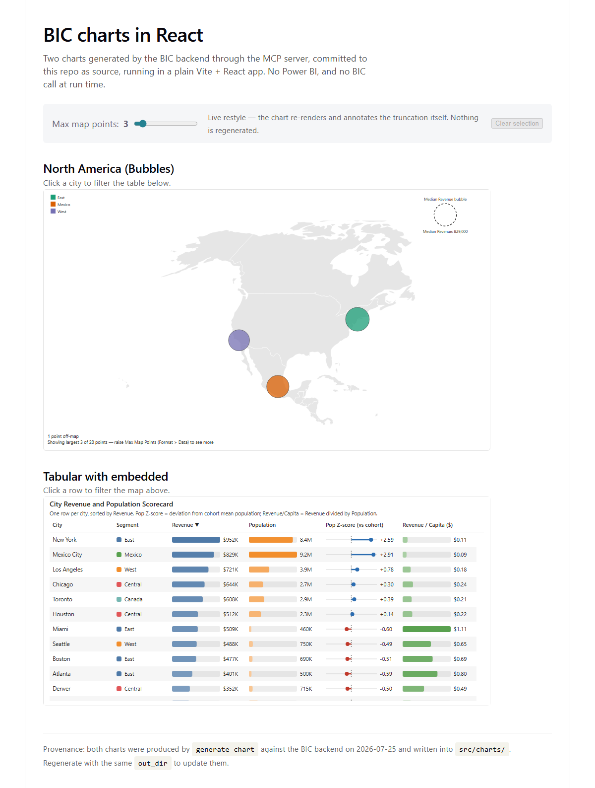

# BIC charts in React

A plain Vite + React app rendering two charts generated by the BIC backend — proof that BIC
chart types are not tied to Power BI.



## What it demonstrates

| | |
| --- | --- |
| **North America (Bubbles)** | Point map over a bundled basemap, with a live "max map points" cap |
| **Tabular with embedded** | Scorecard table with embedded bars and a z-score strip |
| **Cross-chart filtering** | Works BOTH ways — click a bubble to filter the table, or a table row to filter the map |
| **Selection affordance** | The clicked chart dims its unselected marks (including from a legend swatch), exactly as the Power BI visual does |
| **Getting back out** | Click the mark again, click empty canvas, or press Clear |
| **Live restyle** | The slider changes the plotted-point cap; the chart repaints and annotates the truncation itself |

Both charts were produced by the MCP `generate_chart` tool on 2026-07-25 from a 42-row
city-metrics CSV and committed to `reactapp1.client/src/charts/`.

## The architectural point

**A BIC chart is generated source you own, not a service you call.**

Design time (once, per chart):

```text
agent → MCP generate_chart → chart.js + data.sample.json + data.geo.json → committed
```

Run time (every page load): **no API key, no network call, no per-render cost, works
offline.** The only runtime dependencies are `d3` and `@bicharts/chart-host`.

Step-by-step instructions for building this from an empty folder are in
[docs/WALKTHROUGH.md](docs/WALKTHROUGH.md).

## Running it

```bash
npm install
npm run dev          # https://localhost:10391
npm run build        # tsc -b && vite build
```

The ASP.NET half of the Visual Studio template is not used by the chart page.

## How it is wired

- **`@bicharts/chart-host` is an ordinary npm dependency** (`^0.4.0`), resolved from the public
  registry like any other package — no alias, no path mapping, nothing pointing back into this
  repo. That matters: the earlier source-alias arrangement *hid two real defects*, because an
  alias compiles our own source under this app's settings instead of consuming what we publish.
  A tarball that shipped no `shape-core` at all, and a `.d.ts` importing a package no consumer
  installs, both passed under the alias.
- **`src/charts/index.ts`** imports the generated code with `?raw` — `createChartHost`
  compiles it the same way the Power BI visual and the server's exec gate do, so the runtime
  path is identical to production.
- **`<BicChartGroup>`** owns the one source table and translates selections between charts.
  This matters: `rowIdx` values are positions *within the payload a chart received*, so a
  filtered chart's payload renumbers from zero. The group keeps the payload-row → source-row
  map, which is the part a hand-rolled integration silently gets wrong.

## Regenerating a chart

Call the MCP `generate_chart` tool with `out_dir` pointed at the chart's folder
(`reactapp1.client/src/charts/<name>`) — same `out_dir` → the files are overwritten and the
diff is reviewable.

## Verifying it still works

The page was verified by serving the production build and driving it with headless Chromium:
real marks present, cross-filtering in **both** directions, the selection affordance,
clear/toggle-off, the absence of clipped text, and a live restyle (25 checks). If you change
the wiring, re-check at least the two cross-filter directions by hand — they are the part a
refactor breaks silently.

## Two things this demo taught us about hosting charts outside Power BI

**1. A host page's typography leaks into the chart.** Generated charts set `font-size` but
almost never `line-height`, so they inherit the page's. The stock Vite template ships
`:root { font: 18px/145% }`, which handed an 11px column label a 26px line box and sliced it
through the middle — on a chart that renders perfectly inside Power BI. `createChartHost`
now neutralizes `line-height` and `letter-spacing` inside the container it owns. If you
build another host, keep that firewall.

**2. Selection styling is the HOST's job, not the chart's.** Generated code emits marks and
`data-row-idx`; it never styles "selected", because only the host knows what is selected.
The Power BI visual has always dimmed unselected marks; `createChartHost` now does the same,
using the identical class grammar (`lch-has-selection` / `lch-mark-selected` /
`--lch-dim-opacity`), so a chart looks the same wherever it runs.

## Known rough edge — fixed server-side, still present in the committed artifact

The map's truncation message reads *"raise Max Map Points (Format > Data)"* — Power BI's
Format pane, which does not exist here. It was never the model inventing wording: the phrase
was prescribed verbatim by `llm/charttypesupport/d3.json`, so the advice was wrong by
construction in any non-Power BI host.

That instruction is fixed and live in prod (now *"raise the map-point cap to see more"*).
`src/charts/na-bubbles/chart.js` simply predates it — which is the architecture working as
intended: a generated chart is source you own, so it does not silently change under you.
Regenerating that one chart clears it, at the cost of re-rolling its content.
